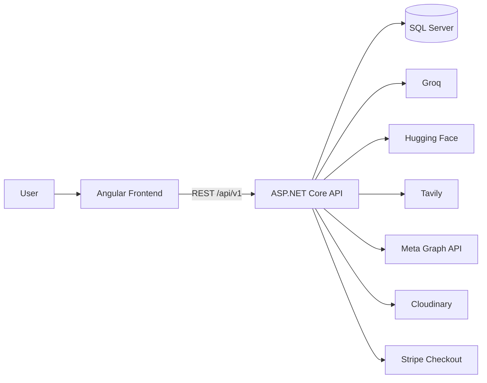

# Rawaj

<p align="center">
  
</p>


Rawaj is an Arabic-first, multi-tenant, AI-powered social media marketing SaaS. It helps businesses and agencies move from brand setup to campaign strategy, AI-generated content, social publishing, and analytics in one workflow.

Live site: [Rawaj](https://rawaj.social)

The product is structured around a campaign lifecycle: onboarding a brand, understanding the business and market, generating a marketing strategy, generating post content and visuals, reviewing the output, scheduling to connected social accounts, and tracking performance.

## Why this project exists

Marketing teams often work across disconnected tools: one system for brand research, another for strategy, another for content creation, another for publishing, another for reporting. Rawaj consolidates that process into a single platform with tenant-aware access, compensation rules, and AI-assisted generation.

The codebase implements that workflow across:

- a multi-tenant SaaS shell
- AI campaign generation and review
- brand and campaign management
- social account connection and scheduling
- billing, coins, and subscription plans
- admin and analytics surfaces

## Core product overview

Rawaj is designed for two primary tenant types:

- Business owners managing their own brand
- Agencies managing multiple brand profiles and team members under one tenant

At a high level, a tenant can:

1. create or manage brand profiles
2. create marketing campaigns
3. generate or review AI strategy output
4. generate content and visuals
5. connect Facebook or Instagram accounts
6. schedule posts
7. review analytics and billing

## Key features

### Campaign-driven AI workflow

The product centers around a guided campaign flow from onboarding to strategy approval to content generation and scheduling. The workflow is implemented as an AI-assisted campaign process that tracks strategy generation, content review, and scheduling.

### Arabic-first, RTL-oriented product design

The project is oriented around Arabic usage and RTL workflows, with multi-tenant roles and Arabic-first product behavior throughout the UI and business logic.

### Multi-tenant authorization and role model

The backend enforces tenant membership and permission rules server-side. Roles in the product are mapped as:

- Viewer
- Editor
- Admin
- Owner

The frontend also gates actions for UX, but the real boundary is enforced in backend handlers and authorization behaviors.

### AI generation and review

The platform integrates:

- Groq for LLM text generation
- Hugging Face for image generation
- Tavily for competitor and market research

The campaign flow is backed by an AI pipeline that tracks stage execution, retries, progress, artifacts, and approval state.

### Social media integration

The actual social publishing layer in the codebase is centered on Meta Graph API for Facebook and Instagram. Users can connect accounts through OAuth and later schedule or publish posts through the platform.

### Content and media management

The app supports:

- content generation and revision
- media storage with Cloudinary support
- local fallback handling for media
- content review and acceptance flow

### Scheduling and calendar

Campaigns can create scheduled posts and manage them through the calendar flows. The backend enforces scheduling constraints and duplicate prevention rules.

### Billing, coins, and subscriptions

Rawaj uses a coin-based spend system layered on subscription plans. The backend contains pricing, plan changes, coin purchase flows, billing history, and plan usage tracking.

### Team collaboration and admin operations

The app supports tenant members, invite-based team flows, brand-scoped access, and platform-level administration.

## How the product works



The primary user journey is:

1. Create a tenant and brand profile.
2. Start an onboarding or campaign flow.
3. Generate or review market and business analysis.
4. Approve a marketing strategy.
5. Generate post content and images.
6. Review content before scheduling.
7. Connect Facebook or Instagram accounts.
8. Schedule posts and track results.

The campaign flow is implemented as a guided onboarding-to-scheduling process that moves from strategy to content approval before publishing.

## Tech stack

| Layer | Technology |
|---|---|
| Frontend | Angular 21, TypeScript, RxJS |
| UI styling | Bootstrap + custom CSS design tokens |
| Animation | GSAP + motion |
| Backend | ASP.NET Core / .NET 10 |
| API layer | ASP.NET Core controllers + MediatR CQRS |
| Validation | FluentValidation |
| Persistence | Entity Framework Core + SQL Server |
| Authentication | JWT + refresh token flow |
| AI text | Groq |
| AI image | Hugging Face |
| Research | Tavily |
| Social OAuth / publishing | Meta Graph API |
| Media storage | Cloudinary |
| Billing | Stripe |
| Email | SMTP (Gmail-based config in appsettings) |

## Architecture

This repository is organized as a layered application with a thin API surface and CQRS-style command/query handlers.

- Frontend: Angular single-page app in `front/`
- Backend API: ASP.NET Core project in `server/Rawaj/Rawaj/`
- Application logic: `server/Rawaj/Rawaj.Application/`
- Domain model: `server/Rawaj/Rawaj.Domain/`
- Persistence and EF Core: `server/Rawaj/Rawaj.Persistence/`
- Infrastructure: `server/Rawaj/Rawaj.Infrastructure/`

The backend follows a layered clean-architecture pattern. Controllers are thin and delegate to MediatR requests/handlers. Each feature is organized under a `Features/<Module>/<Action>/` structure, with validation and responses handled alongside the command/query.

## Project structure

```text
rawaj/
├── LICENSE
├── README.md
├── front/
│   ├── angular.json
│   ├── package.json
│   ├── public/
│   └── src/
│       ├── app/
│       ├── environments/
│       └── styles/
├── server/
│   └── Rawaj/
│       ├── Rawaj/
│       ├── Rawaj.Application/
│       ├── Rawaj.Application.Tests/
│       ├── Rawaj.Domain/
│       ├── Rawaj.Infrastructure/
│       └── Rawaj.Persistence/
└── .gitignore
```

## Getting started

### Prerequisites

- Node.js and npm
- .NET SDK 10
- SQL Server instance available for the backend
- API credentials for Groq, Hugging Face, Tavily, Meta, and Stripe if you want to exercise live integrations

### Clone and install

```bash
git clone <repository-url>
cd rawaj
```

#### Frontend

```bash
cd front
npm install
npm run start
```

The Angular app is configured to run against the backend at:

- `http://localhost:5046/api/v1`

#### Backend

```bash
cd server/Rawaj
dotnet restore
dotnet run --project Rawaj/Rawaj.csproj
```

The backend is configured to run with development settings and exposes the API on:

- `http://localhost:5046`
- `https://localhost:7206` (configured in `launchSettings.json`)

The application checks migrations on startup and runs them automatically:

```csharp
db.Database.Migrate();
```

## Configuration and environment variables

The application configuration is stored in the ASP.NET Core configuration files under:

- `server/Rawaj/Rawaj/appsettings.json`
- `server/Rawaj/Rawaj/appsettings.Development.json`

Key sections in the config include:

```json
{
  "ConnectionStrings": {
    "DefaultConnection": "..."
  },
  "Jwt": {
    "Secret": "...",
    "Issuer": "Rawaj.Issuer",
    "Audience": "Rawaj.Audience",
    "ExpiryMinutes": 60,
    "RefreshTokenExpiryDays": 30
  },
  "Groq": {
    "ApiKeys": ["..."],
    "Model": "openai/gpt-oss-120b",
    "BaseUrl": "https://api.groq.com/openai/v1"
  },
  "HuggingFace": {
    "ApiKeys": ["..."],
    "ImageModel": "black-forest-labs/FLUX.1-schnell"
  },
  "Tavily": {
    "ApiKeys": ["..."],
    "MaxResults": 5
  },
  "SocialOAuth": {
    "Meta": {
      "ClientId": "...",
      "ClientSecret": "...",
      "ApiVersion": "v25.0"
    }
  },
  "Cloudinary": {
    "CloudName": "...",
    "ApiKey": "...",
    "ApiSecret": "..."
  },
  "Stripe": {
    "SecretKey": "...",
    "PublishableKey": "...",
    "WebhookSecret": "..."
  },
  "Frontend": {
    "BaseUrl": "http://localhost:4200"
  },
  "Cors": {
    "AllowedOrigins": ["http://localhost:4200"]
  }
}
```

Important notes:

- The backend runs a default CORS policy from `Cors:AllowedOrigins`.
- OAuth callbacks redirect back to the frontend using `Frontend:BaseUrl`.
- The app reads API keys and secrets from `appsettings*.json`; production deployments should replace placeholders with real credentials and rotate any checked-in secrets.
- The repo contains a development config with actual local values; treat those as development-only sample configuration and replace them when preparing a deployment environment.

## Running the app

### Frontend

```bash
cd front
npm install
npm run start
```

Open:

- `http://localhost:4200`

### Backend

```bash
cd server/Rawaj
dotnet restore
dotnet run --project Rawaj/Rawaj.csproj
```

The API is served on:

- `http://localhost:5046`
- `https://localhost:7206`

The frontend environment file is:

- `front/src/environments/environment.ts`
- `front/src/environments/environment.development.ts`

Both are configured to point to `http://localhost:5046/api/v1`.

## AI integrations

Rawaj includes multiple AI providers arranged behind application-layer interfaces and policy rules.

| Feature | Provider |
|---|---|
| Text generation | Groq |
| Image generation | Hugging Face |
| Research and competitive analysis | Tavily |
| Campaign strategy pipeline orchestration | Groq + Tavily + Hugging Face |

The AI pipeline is the core of the marketing campaign flow. It tracks runs, stage execution, retries, artifact output, and approval steps as part of the integrated campaign workflow.

## Social media integrations

The repository implements social account connection and publishing around Meta's Graph API, specifically for Facebook and Instagram.

### Supported pattern

- Users request a platform authorization URL from the backend.
- The browser is redirected to the social platform consent flow.
- The OAuth callback is handled by the backend.
- The frontend is redirected back to the dashboard social accounts page.

The relevant controller is:

- `server/Rawaj/Rawaj/Controllers/SocialAccountsController.cs`

The app also includes platform-specific OAuth configuration under `SocialOAuth` in the backend settings.

## Testing

The repository contains backend tests under:

- `server/Rawaj/Rawaj.Application.Tests/`

Run backend tests:

```bash
cd server/Rawaj
dotnet test
```

Run frontend tests:

```bash
cd front
npm run test
```

The project also supports build validation:

```bash
cd front
npm run build
```

```bash
cd server/Rawaj
dotnet build Rawaj.slnx
```

## Deployment

The project is structured for a standard ASP.NET Core + Angular deployment model:

- backend serves the API and handles authentication, AI orchestration, and persistence
- frontend is an Angular app served separately
- production requires proper values for CORS, frontend URLs, Stripe, OAuth credentials, and storage configuration
- the backend enables HTTPS redirection and health checks at `/health` and `/health/live`

The project configuration includes:

- `Frontend:BaseUrl`
- `Cors:AllowedOrigins`
- `PublicImageHosting:PublicBaseUrl`
- `Cloudinary:*`
- `Stripe:*`

These must all be configured correctly for a production deployment.

## License

This repository is licensed under the Rawaj Source-Available License 1.0.

See [LICENSE](LICENSE) for the full text.

Rawaj is a real working codebase for an AI-led marketing workflow, not a template. The README above reflects the current repository structure and implementation patterns as they exist in the project at this time.
